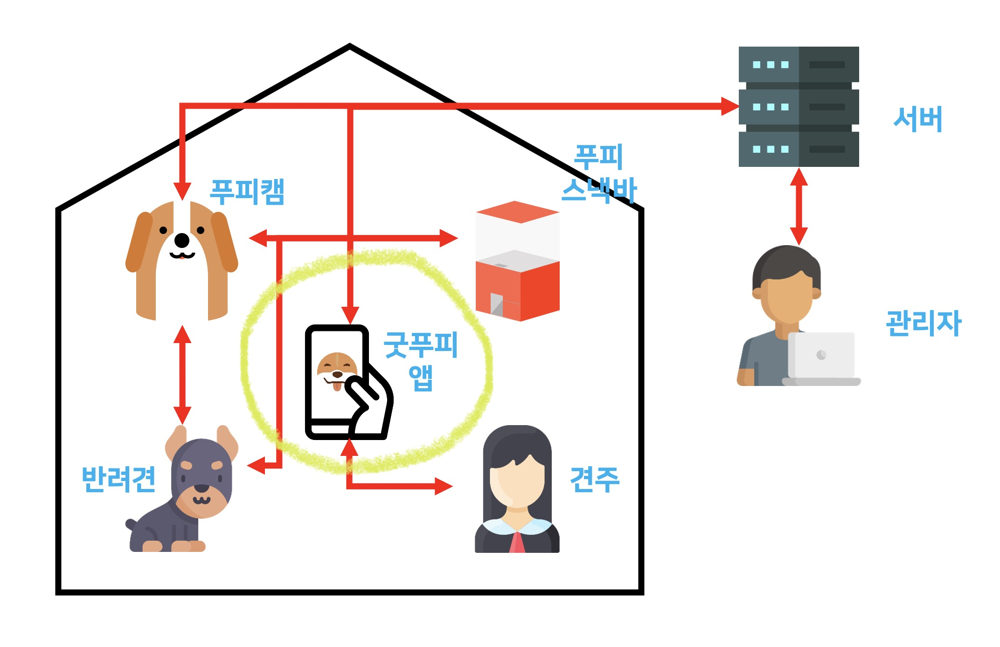
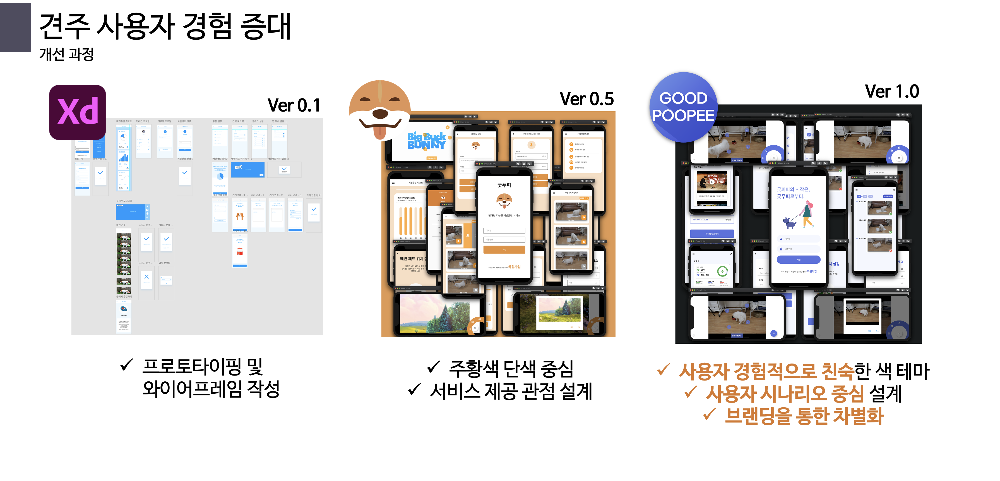
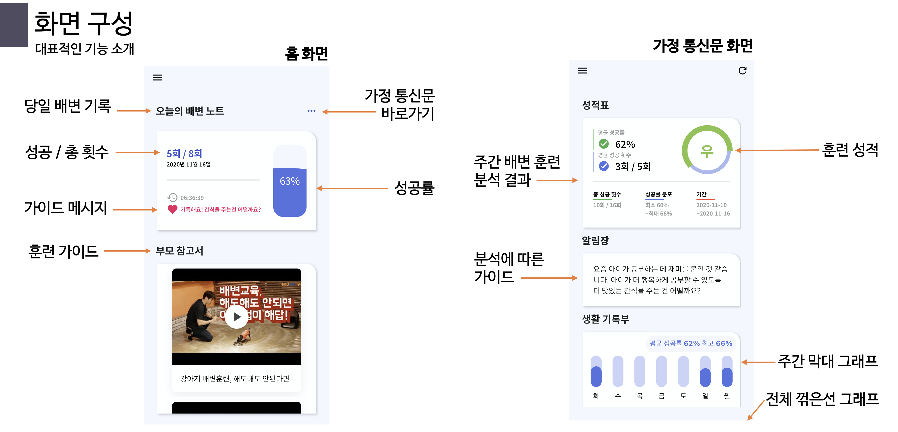
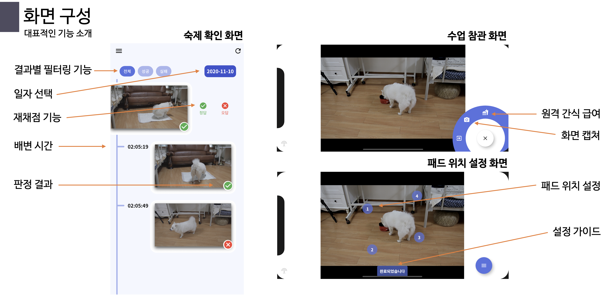
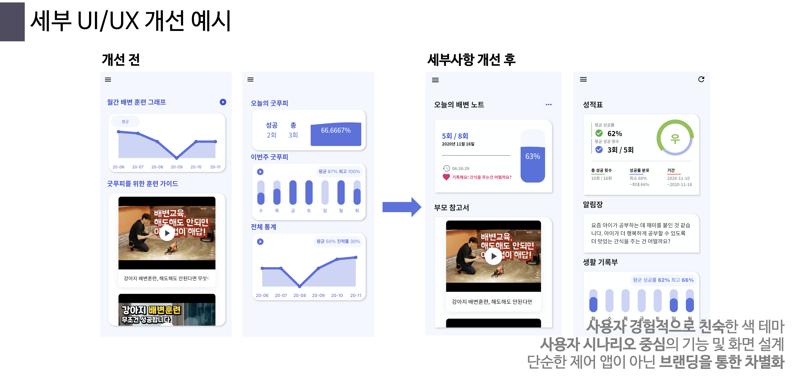

# Frontend Repo

반려견 지능형 배변훈련 서비스 '굿푸피'  
SW Maestro 11기 팀 우릴봐

- 하경민 (팀장)
- 방승연
- 전형준

담당 멘토

- 강진범
- 김윤래
- 박정규
- 오은석
- 최광선

## Table of Contents

- [Frontend Repo](#frontend-repo)
  - [Table of Contents](#table-of-contents)
  - [About The Project](#about-the-project)
    - [Versioning](#versioning)
    - [Details](#details)
    - [Deployment](#deployment)
  - [Contact](#contact)
    - [팀 우릴봐](#팀-우릴봐)

## About The Project

견주들을 위한 굿푸피 앱을 개발합니다.

### Versioning

### Details

### Deployment

기기인 푸피캠과 푸피스낵바와 함께 사용하는 어플이므로,  
기기 출시전 앱 스토어 배포는 불필요했기 때문에,  
iOS TestFlight, Android apk file을 이용해 테스트까지 완료하였습니다.  

## Contact

### 팀 우릴봐

- 하경민 (팀장) gaonrudal@gmail.com
- 방승연 baaaang_53@yonsei.ac.kr
- 전형준 chariot0720@gmail.com
